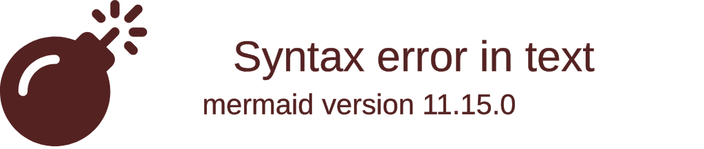
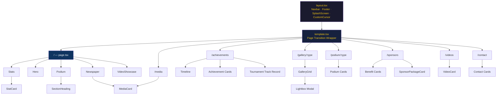
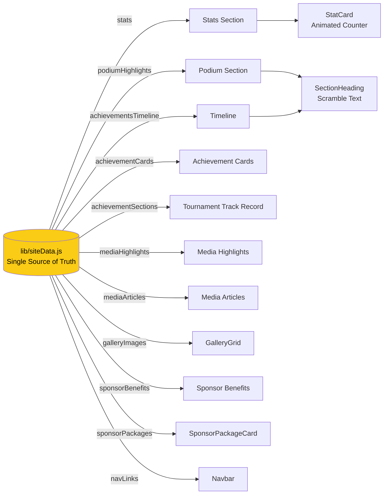
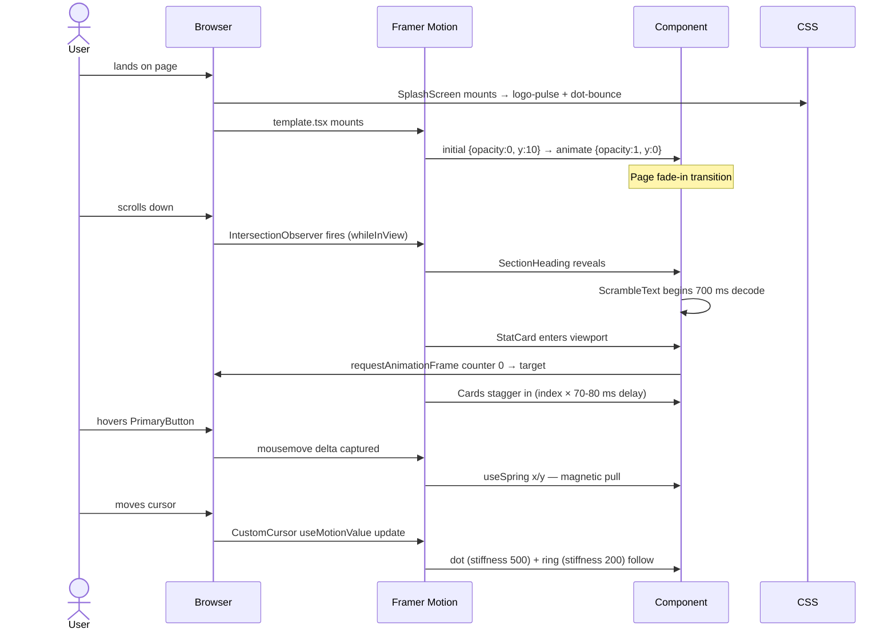

# Matheesha Wijesekara — Elite Squash Athlete Portfolio

[](https://nextjs.org/)
[](https://www.typescriptlang.org/)
[](https://tailwindcss.com/)
[](https://www.framer.com/motion/)
[](LICENSE)

A high-performance, dark-themed sports portfolio for **Matheesha Wijesekara** — Sri Lanka's #1 ranked U19 squash athlete, Asian Junior Rank #7, and World Junior Plate Semi-Finalist. Built with the Next.js App Router, Tailwind CSS v4, and Framer Motion.

---

## Table of Contents

- [Overview](#overview)
- [Live Demo](#live-demo)
- [Key Features](#key-features)
- [Tech Stack](#tech-stack)
- [Project Structure](#project-structure)
- [Prerequisites](#prerequisites)
- [Getting Started](#getting-started)
- [Environment Variables](#environment-variables)
- [Available Scripts](#available-scripts)
- [Content Management](#content-management)
- [Animation System](#animation-system)
- [System Architecture](#system-architecture)
- [Deployment](#deployment)
- [Contributing](#contributing)
- [License](#license)

---

## Overview

This portfolio serves as Matheesha's digital presence for sponsors, media organisations, and tournament organisers. It showcases competitive rankings, achievement timelines, gallery highlights, media coverage, and structured sponsorship packages — all delivered through a cinematic, performance-optimised web experience.

---

## Live Demo

> Deployed on Vercel. Visit: **[matheesha.vercel.app](https://matheesha.vercel.app)** _(update with your actual URL)_

---

## Key Features

| Feature                         | Description                                                                       |
| ------------------------------- | --------------------------------------------------------------------------------- |
| **Animated Stat Counters**      | Rankings count up from zero on scroll using easeOut cubic interpolation           |
| **Aurora Hero Background**      | Multi-point animated radial gradient that shifts position over a 10 s loop        |
| **Scramble Text Headings**      | Section titles decode from randomised characters when they enter the viewport     |
| **Magnetic CTA Buttons**        | "Become a Sponsor" button follows the cursor with spring physics                  |
| **Custom Cursor**               | Yellow dot + trailing ring replaces the default cursor on pointer devices         |
| **Staggered Card Reveals**      | Gallery, sponsor benefits, and achievement cards cascade in with 70–80 ms stagger |
| **Scroll-triggered Animations** | Every section heading and content block uses `whileInView` with `once: true`      |
| **Smooth Page Transitions**     | Next.js `template.tsx` provides a fade+slide transition between all routes        |
| **Splash Screen**               | Full-screen logo intro with animated loading dots, auto-dismisses after 8 s       |
| **Lightbox Gallery**            | Click-to-expand gallery with AnimatePresence exit animation                       |
| **Video Showcase**              | Embedded YouTube highlights with thumbnail previews                               |
| **Sponsor Packages**            | Tiered Gold / Silver / Bronze cards with itemised perks                           |
| **Responsive Layout**           | Mobile-first design, fully functional from 320 px to 4 K                          |
| **Go-to-Top Button**            | Appears on scroll, smooth-scrolls back to top                                     |

---

## Tech Stack

| Layer     | Technology                                                                             |
| --------- | -------------------------------------------------------------------------------------- |
| Framework | [Next.js 16](https://nextjs.org/) (App Router)                                         |
| Language  | [TypeScript 5](https://www.typescriptlang.org/) + JavaScript (mixed `.ts`/`.js` pages) |
| Styling   | [Tailwind CSS v4](https://tailwindcss.com/) via `@tailwindcss/postcss`                 |
| Animation | [Framer Motion 12](https://www.framer.com/motion/)                                     |
| Font      | [Geist](https://vercel.com/font) via `next/font/google`                                |
| Images    | `next/image` with local + Unsplash remote patterns                                     |
| Linting   | ESLint 9 with `eslint-config-next` (Core Web Vitals + TypeScript)                      |
| CI        | GitHub Actions (Node.js 20, `npm ci` + `npm run build`)                                |
| Hosting   | [Vercel](https://vercel.com/)                                                          |

---

## Project Structure

```
.
├── app/                        # Next.js App Router
│   ├── layout.tsx              # Root layout — Navbar, Footer, SplashScreen, CustomCursor
│   ├── template.tsx            # Page transition wrapper (AnimatePresence)
│   ├── page.tsx                # Home — Hero, Stats, Podium, VideoShowcase, Newspaper
│   ├── globals.css             # Global styles, Tailwind imports, animation keyframes
│   ├── achievements/
│   │   └── page.js             # Timeline, achievement cards, tournament track record
│   ├── contact/
│   │   └── page.js             # Contact cards — athlete and manager
│   ├── gallery/
│   │   ├── local/page.js       # Local competition gallery
│   │   ├── international/page.js
│   │   └── school/page.js
│   ├── media/
│   │   └── page.js             # Newspaper articles and media highlights
│   ├── podium/
│   │   ├── local/page.js
│   │   └── international/page.js
│   ├── sponsors/
│   │   └── page.js             # Sponsor benefits and package tiers
│   └── videos/
│       └── page.js             # Video showcase page
│
├── components/                 # Reusable UI components
│   ├── CustomCursor.tsx        # Yellow dot cursor with spring-physics trailing ring
│   ├── ScrambleText.tsx        # Character-scramble reveal animation
│   ├── StatCard.tsx            # Animated counter card
│   ├── SectionHeading.tsx      # Scroll-triggered heading with ScrambleText
│   ├── PrimaryButton.tsx       # Magnetic CTA button
│   ├── Hero.tsx                # Full-screen hero with aurora background
│   ├── Stats.tsx               # Rankings section
│   ├── Podium.tsx              # Signature achievements grid
│   ├── Timeline.tsx            # Vertical achievement timeline
│   ├── GalleryGrid.tsx         # Staggered image grid with lightbox
│   ├── VideoShowcase.tsx       # YouTube embed showcase
│   ├── Newspaper.tsx           # Media article cards
│   ├── MediaCard.tsx           # Individual media card
│   ├── VideoCard.tsx           # Individual video card
│   ├── SponsorPackageCard.tsx  # Tiered sponsor package card
│   ├── SplashScreen.tsx        # Intro splash with logo and loading dots
│   ├── Navbar.tsx              # Responsive navigation with dropdown menus
│   ├── Footer.tsx              # Site footer
│   ├── Container.tsx           # Max-width layout wrapper
│   ├── GoToTopButton.tsx       # Scroll-to-top floating button
│   └── PrimaryButton.tsx       # (see above)
│
├── lib/
│   └── siteData.js             # Single source of truth for all content
│
├── public/
│   ├── matheesha_logo.png
│   ├── matheesha_profile.png
│   └── assets/
│       ├── gallery/            # Local, international, school images
│       ├── media/              # Press/PDF assets
│       ├── podium/             # Podium photos
│       └── vedios/             # Video files and captions
│
├── .github/
│   └── workflows/
│       └── webpack.yml         # CI — install + build on every push to main
├── next.config.ts
├── tsconfig.json
├── postcss.config.mjs
├── eslint.config.mjs
└── package.json
```

---

## Prerequisites

| Tool    | Minimum Version |
| ------- | --------------- |
| Node.js | 20.x            |
| npm     | 10.x            |

---

## Getting Started

**1. Clone the repository**

```bash
git clone https://github.com/Aakashwije/Matheesha_portfolio.git
cd Matheesha_portfolio
```

**2. Install dependencies**

```bash
npm ci
```

**3. Start the development server**

```bash
npm run dev
```

Open [http://localhost:3000](http://localhost:3000) in your browser.

---

## Environment Variables

This project currently requires **no environment variables** for local development. All content is sourced from `lib/siteData.js` and static assets in `public/`.

If you integrate analytics or a CMS in future, add a `.env.local` file at the project root:

```env
# Example — not required by default
NEXT_PUBLIC_GA_ID=G-XXXXXXXXXX
```

---

## Available Scripts

| Script            | Command         | Description                                            |
| ----------------- | --------------- | ------------------------------------------------------ |
| Development       | `npm run dev`   | Starts Next.js dev server with HMR at `localhost:3000` |
| Production build  | `npm run build` | Compiles and optimises for production                  |
| Production server | `npm run start` | Serves the production build                            |
| Lint              | `npm run lint`  | Runs ESLint across all `.ts`, `.tsx`, and `.js` files  |

---

## Content Management

All site content lives in a single file — **`lib/siteData.js`**. No CMS or database is required.

| Export                 | What it controls                                          |
| ---------------------- | --------------------------------------------------------- |
| `navLinks`             | Navigation links and dropdown structure                   |
| `stats`                | Rankings displayed on the Stats section (e.g. `#1`, `#7`) |
| `podiumHighlights`     | Signature achievement cards on the home page              |
| `achievementsTimeline` | Year-by-year timeline on the Achievements page            |
| `achievementCards`     | Awards and ranking highlight cards                        |
| `achievementSections`  | Full tournament track record grouped by category          |
| `mediaHighlights`      | Featured media cards on the home page                     |
| `mediaArticles`        | Full article listing on the Media page                    |
| `galleryImages`        | Gallery image sources and alt text                        |
| `sponsorBenefits`      | List of sponsor visibility benefits                       |
| `sponsorPackages`      | Gold / Silver / Bronze tier names, prices, and perks      |

**Example — updating a ranking:**

```js
// lib/siteData.js
export const stats = [
  { label: "National Rank - U19", value: "#1" },
  { label: "Men's Open Rank", value: "#8" },
  { label: "Asian Rank - U19", value: "#7" }, // ← edit here
];
```

---

## Animation System

All animations are built on **Framer Motion** with no additional animation libraries.

| Animation         | Component                               | Mechanism                                                  |
| ----------------- | --------------------------------------- | ---------------------------------------------------------- |
| Stat counter      | `StatCard.tsx`                          | `useInView` + `requestAnimationFrame` cubic easing         |
| Scramble text     | `ScrambleText.tsx`                      | `useInView` + character randomisation over 700 ms          |
| Scroll reveal     | `SectionHeading.tsx`, `Timeline.tsx`    | `whileInView` + `viewport={{ once: true }}`                |
| Stagger           | `GalleryGrid.tsx`, `Sponsors`, `Podium` | `transition.delay` indexed by `index * 0.07-0.1`           |
| Aurora background | `Hero.tsx` + `globals.css`              | CSS `@keyframes aurora-move` — 3 shifting radial gradients |
| Magnetic button   | `PrimaryButton.tsx`                     | `useMotionValue` + `useSpring` tracking cursor delta       |
| Custom cursor     | `CustomCursor.tsx`                      | Two `motion.div` layers with different spring stiffness    |
| Page transition   | `app/template.tsx`                      | Next.js template re-mount + Framer `initial`/`animate`     |
| Float             | `Hero.tsx` profile image                | CSS `animate-float-soft` — 4.5 s sinusoidal translateY     |
| Splash screen     | `SplashScreen.tsx`                      | CSS `animate-logo-pulse` + `animate-dot` bouncing dots     |

> **Touch devices:** The custom cursor is automatically hidden on touch screens via `@media (pointer: coarse) { body { cursor: auto; } }`.

---

## System Architecture

### 1. High-Level System Overview

How the browser, CDN, and external services relate at runtime.



---

### 2. Next.js App Router — Page & Component Tree

Every route and the major components it composes.



---

### 3. Data Flow — Content to UI

How `siteData.js` feeds into every page and component.



---

### 4. Animation Pipeline

How a user scrolling triggers the full animation chain.



---

### 5. CI / CD Pipeline

From a `git push` to a live production URL.

```mermaid
flowchart TD
  Dev[Developer pushes to main] --> GHA

  subgraph GHA [GitHub Actions]
    A[actions/checkout@v4] --> B[actions/setup-node@v4\nNode 20.x]
    B --> C[npm ci]
    C --> D[npm run build\nnext build]
    D -->|exit 0| Pass[✅ Build passed]
    D -->|exit 1| Fail[❌ Build failed\nNotify via Actions UI]
  end

  Dev --> Vercel

  subgraph Vercel [Vercel Platform]
    V1[Detect push to main] --> V2[Install dependencies]
    V2 --> V3[next build]
    V3 --> V4[Deploy to Edge Network]
    V4 --> V5[🌐 Live at production URL]
    V4 --> V6[Preview URL generated\nfor PRs]
  end

  style Pass fill:#166534,color:#fff
  style Fail fill:#991b1b,color:#fff
  style V5 fill:#166534,color:#fff
```

---

## Deployment

The project is configured for zero-config deployment on **Vercel**.

**Via Vercel Dashboard:**

1. Go to [vercel.com/new](https://vercel.com/new)
2. Import the `Matheesha_portfolio` GitHub repository
3. Vercel auto-detects Next.js — click **Deploy**
4. Every subsequent push to `main` triggers an automatic redeploy

**Manual build check (CI):**

GitHub Actions runs on every push to `main`:

```yaml
# .github/workflows/webpack.yml
- run: npm ci
- run: npm run build
```

---

## Contributing

1. Fork the repository
2. Create a feature branch: `git checkout -b feat/your-feature`
3. Commit your changes: `git commit -m "feat: add your feature"`
4. Push to the branch: `git push origin feat/your-feature`
5. Open a Pull Request against `main`

Please ensure `npm run lint` and `npm run build` pass before opening a PR.

---

## License

This project is licensed under the **MIT License**. See the [LICENSE](LICENSE) file for details.

---

<div align="center">
  <sub>Built with precision for <strong>Matheesha Wijesekara</strong> — Sri Lanka's elite squash athlete.</sub>
</div>
