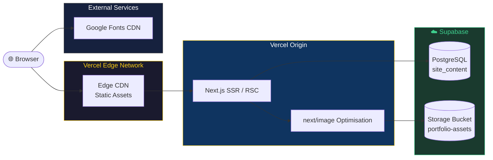
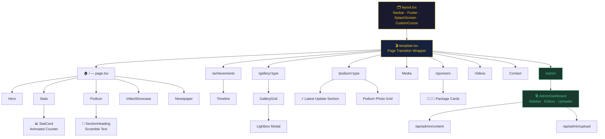
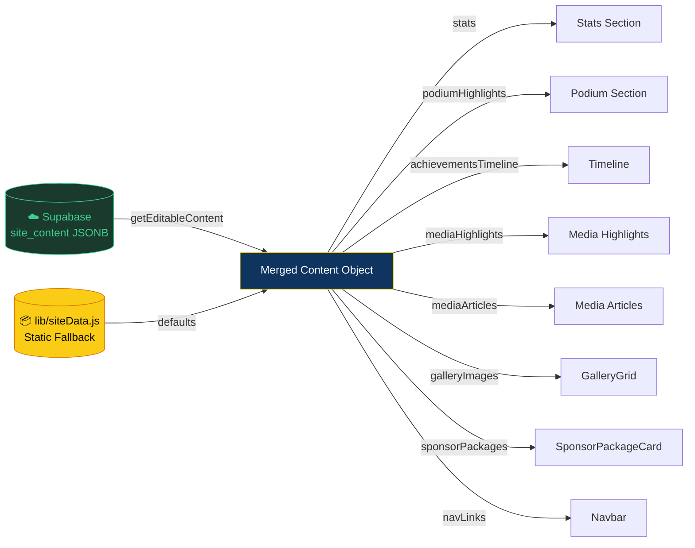
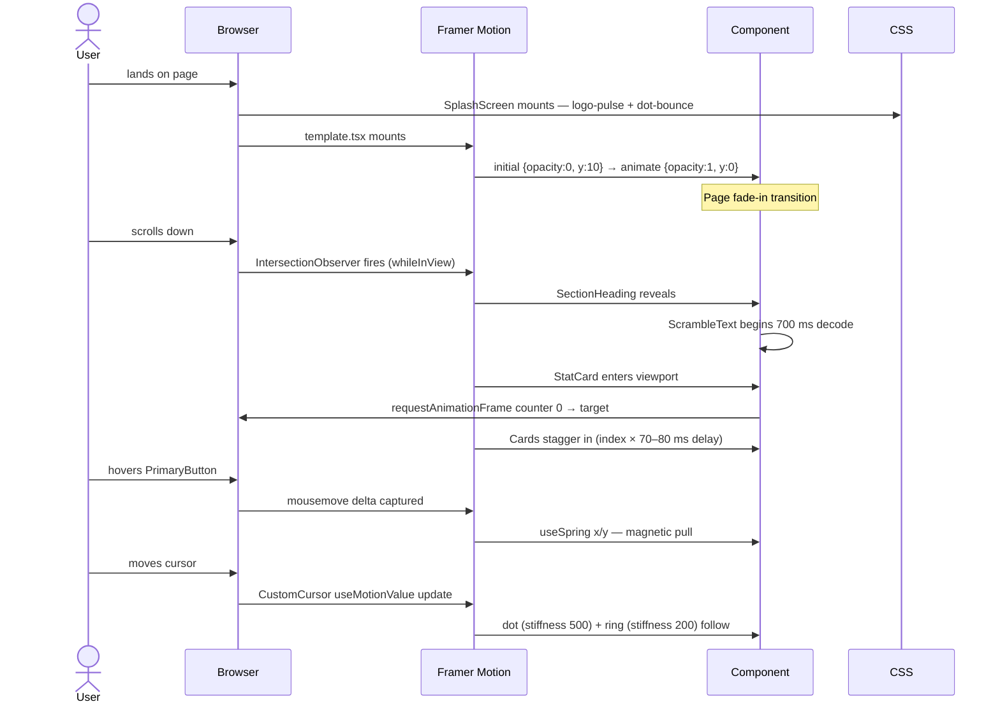
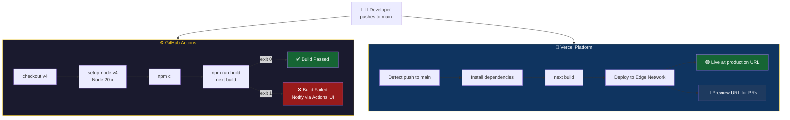
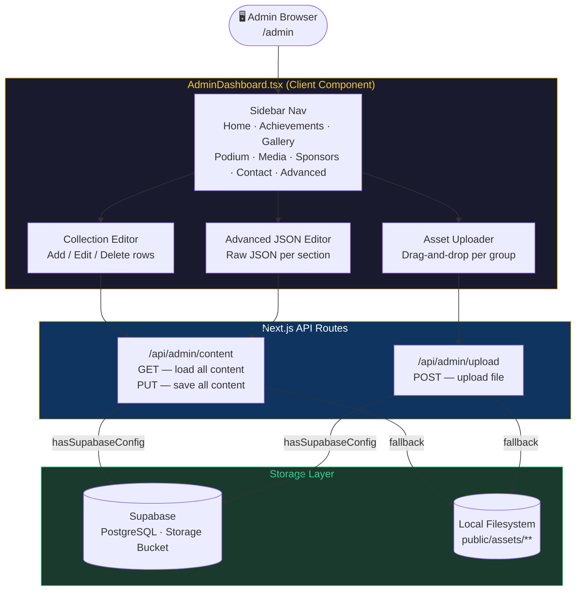
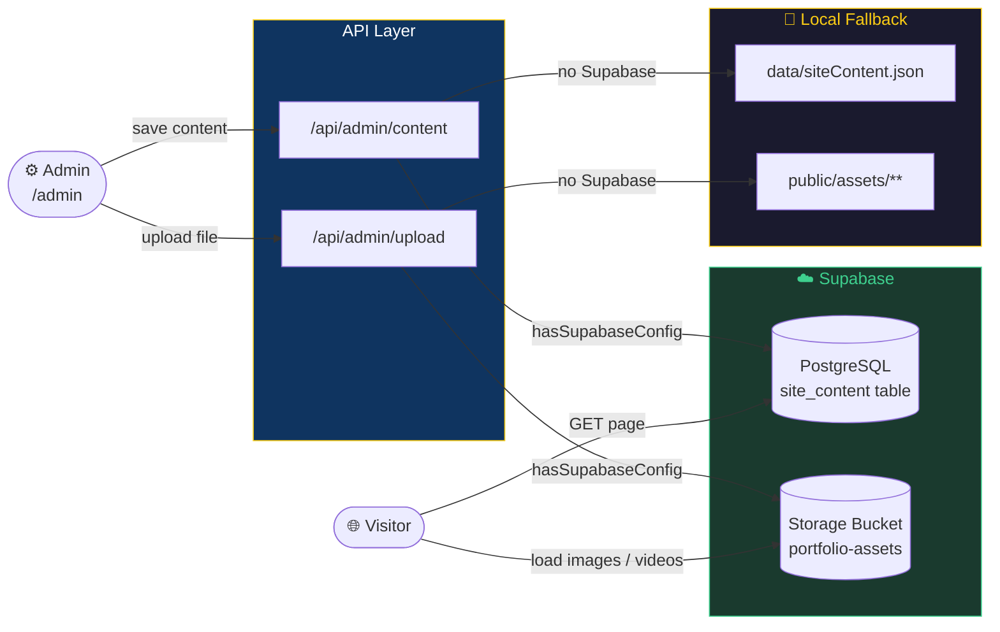

<div align="center">


<h1>Matheesha Wijesekara</h1>
<p><strong>Elite Squash Athlete · Sri Lanka #1 U19 · Asian Junior Rank #7</strong></p>

<p>
  <a href="https://nextjs.org/"></a>
  <a href="https://www.typescriptlang.org/"></a>
  <a href="https://tailwindcss.com/"></a>
  <a href="https://www.framer.com/motion/"></a>
  <a href="https://vercel.com/"></a>
  <a href="LICENSE"></a>
</p>

<p>
  
  
  
  
  
  
  
</p>

<p>A cinematic, dark-themed sports portfolio for <strong>Matheesha Wijesekara</strong> — Sri Lanka's #1 ranked U19 squash athlete, Asian Junior Rank #7, and World Junior Plate Semi-Finalist. Built with Next.js App Router, Tailwind CSS v4, Framer Motion, and a full Supabase-backed admin dashboard.</p>

</div>

---

## 📑 Table of Contents

- [Overview](#overview)
- [Live Demo](#live-demo)
- [Key Features](#key-features)
- [Tech Stack](#tech-stack)
- [Project Structure](#project-structure)
- [System Architecture](#system-architecture)
- [Admin Dashboard](#admin-dashboard)
- [Supabase Integration](#supabase-integration)
- [Getting Started](#getting-started)
- [Environment Variables](#environment-variables)
- [Available Scripts](#available-scripts)
- [Content Management](#content-management)
- [Deployment](#deployment)
- [Contributing](#contributing)
- [License](#license)

---

## Overview

This portfolio is Matheesha's digital presence for sponsors, media organisations, and tournament organisers. It showcases competitive rankings, achievement timelines, gallery highlights, media coverage, and structured sponsorship packages — all delivered through a performance-optimised, cinematic web experience. A built-in admin dashboard backed by Supabase lets all content and assets be managed without touching code.

---

## Live Demo

> Deployed on Vercel — visit **[matheesha.vercel.app](https://matheesha.vercel.app)** _(update with your production URL)_

---

## Key Features

| Feature | Description |
|---|---|
| 🏆 **Animated Stat Counters** | Rankings count up from zero on scroll using easeOut cubic interpolation |
| 🌌 **Aurora Hero Background** | Multi-point animated radial gradient shifting over a 10 s loop |
| 🔡 **Scramble Text Headings** | Section titles decode from randomised characters when entering the viewport |
| 🧲 **Magnetic CTA Buttons** | "Become a Sponsor" button follows the cursor with spring physics |
| 🖱️ **Custom Cursor** | Yellow dot + trailing ring replaces the default cursor on pointer devices |
| 🃏 **Staggered Card Reveals** | Gallery, sponsor, and achievement cards cascade in with 70–80 ms stagger |
| 📜 **Scroll-triggered Animations** | Every section uses `whileInView` with `once: true` |
| 🎬 **Smooth Page Transitions** | `template.tsx` provides a fade+slide transition between all routes |
| 🚀 **Splash Screen** | Full-screen logo intro with animated loading dots, auto-dismisses after 8 s |
| 🖼️ **Lightbox Gallery** | Click-to-expand gallery with AnimatePresence exit animation |
| 🎥 **Video Showcase** | Local video highlights with thumbnail previews and modal playback |
| 💰 **Sponsor Packages** | Tiered Gold / Silver / Bronze cards with itemised perks |
| 📱 **Responsive Layout** | Mobile-first design, fully functional from 320 px to 4 K |
| ⬆️ **Go-to-Top Button** | Appears on scroll, smooth-scrolls back to top |
| 🛠️ **Admin Dashboard** | Password-free `/admin` route to edit all content and upload assets |
| ☁️ **Supabase Backend** | PostgreSQL content store + CDN-backed Storage bucket for all assets |

---

## Tech Stack

<div align="center">

| Layer | Technology | Badge |
|---|---|---|
| **Framework** | Next.js 16 (App Router) |  |
| **Language** | TypeScript 5 + JavaScript |  |
| **Styling** | Tailwind CSS v4 via `@tailwindcss/postcss` |  |
| **Animation** | Framer Motion 12 |  |
| **Icons** | Lucide React |  |
| **Font** | Geist via `next/font/google` |  |
| **Database / Storage** | Supabase (PostgreSQL + Storage) |  |
| **Admin** | Custom Next.js dashboard at `/admin` |  |
| **Runtime** | Node.js 20 |  |
| **Linting** | ESLint 9 + `eslint-config-next` |  |
| **CI** | GitHub Actions |  |
| **Hosting** | Vercel |  |

</div>

---

## Project Structure

```
.
├── app/                                # Next.js App Router
│   ├── layout.tsx                      # Root layout — Navbar, Footer, SplashScreen, CustomCursor
│   ├── template.tsx                    # Page transition wrapper (AnimatePresence)
│   ├── page.tsx                        # Home — Hero, Stats, Podium, VideoShowcase, Newspaper
│   ├── globals.css                     # Global styles, Tailwind imports, animation keyframes
│   ├── admin/
│   │   ├── page.tsx                    # Admin entry — force-dynamic server component
│   │   └── AdminDashboard.tsx          # Full admin UI — sidebar nav, editors, asset uploader
│   ├── api/admin/
│   │   ├── content/route.js            # GET / PUT — read & save site content
│   │   └── upload/route.js             # POST — file upload to Supabase or local FS
│   ├── achievements/page.js            # Timeline, achievement cards, tournament track record
│   ├── contact/page.js                 # Contact cards — athlete and manager
│   ├── gallery/
│   │   ├── local/page.js
│   │   ├── international/page.js
│   │   └── school/page.js
│   ├── media/page.js                   # Newspaper articles and media highlights
│   ├── podium/
│   │   ├── local/page.js               # Local podium with Latest Update section
│   │   └── international/page.js
│   ├── sponsors/page.js                # Sponsor benefits and package tiers
│   └── videos/page.js                  # Video showcase page
│
├── components/                         # Reusable UI components
│   ├── CustomCursor.tsx
│   ├── ScrambleText.tsx
│   ├── StatCard.tsx
│   ├── SectionHeading.tsx
│   ├── PrimaryButton.tsx
│   ├── Hero.tsx
│   ├── Stats.tsx
│   ├── Podium.tsx
│   ├── Timeline.tsx
│   ├── GalleryGrid.tsx
│   ├── VideoShowcase.tsx
│   ├── Newspaper.tsx
│   ├── MediaCard.tsx
│   ├── VideoCard.tsx
│   ├── SponsorPackageCard.tsx
│   ├── SplashScreen.tsx
│   ├── Navbar.tsx
│   ├── Footer.tsx
│   ├── Container.tsx
│   └── GoToTopButton.tsx
│
├── lib/
│   ├── siteData.js                     # Static fallback content (single source of truth)
│   ├── content.js                      # getEditableContent, saveEditableContent, asset helpers
│   └── supabaseAdmin.js                # Server-only Supabase admin client
│
├── data/
│   └── siteContent.json                # Local content fallback (used when Supabase is offline)
│
├── public/
│   ├── matheesha_logo.png
│   ├── matheesha_profile.png
│   └── assets/
│       ├── gallery/                    # Local, international, school images
│       ├── media/                      # Press / PDF assets
│       ├── podium/                     # Local and international podium photos
│       ├── uploads/                    # Admin-uploaded assets (local fallback)
│       └── vedios/                     # Video files (mp4) and captions (vtt)
│
├── supabase-setup.sql                  # One-time SQL — create site_content table + RLS
├── .github/workflows/webpack.yml       # CI — install + build on every push to main
├── next.config.ts
├── tsconfig.json
├── postcss.config.mjs
├── eslint.config.mjs
└── package.json
```

---

## System Architecture

### 1. High-Level Runtime Overview



---

### 2. Next.js App Router — Page & Component Tree



---

### 3. Data Flow — `siteData.js` / Supabase → UI



---

### 4. Animation Pipeline



---

### 5. CI / CD Pipeline



---

## Admin Dashboard

The portfolio includes a built-in admin dashboard at **`/admin`** that lets you manage all site content and assets without touching code.

### Accessing the Dashboard

```
http://localhost:3000/admin
```

> In production, protect this route with Vercel password protection or add Next.js middleware-based authentication.

### Dashboard Sections

| Section | What you can manage |
|---|---|
| 🏠 **Home** | Hero profile image, home gallery images, video files, section copy |
| 🏆 **Achievements** | Timeline entries, award cards, tournament track record |
| 🖼️ **Gallery** | Local, international, and school gallery images |
| 🥇 **Podium** | Local and international podium photos, latest update cards |
| 📰 **Media** | Media photos, PDFs, article cards |
| 💰 **Sponsors** | Sponsor benefit list, Gold/Silver/Bronze package tiers |
| 📬 **Contact** | Contact card labels, names, links |
| ⚙️ **Advanced** | Raw JSON editor for every content collection |

### Editable Content Collections

| Collection | Controls |
|---|---|
| `stats` | Ranking values and labels |
| `podiumHighlights` | Home podium achievement cards |
| `mediaHighlights` | Home media feature cards |
| `mediaArticles` | Full media page article list |
| `achievementsTimeline` | Year-by-year timeline entries |
| `achievementCards` | Award highlight cards |
| `latestUpdateCards` | Latest update section on Local Podium |
| `galleryImages` | Home gallery card sources and alt text |
| `contactCards` | Contact details and links |
| `olResults` | O/L academic results |
| `sponsorBenefits` | Sponsor visibility benefits |
| `sponsorPackages` | Tiered package names, prices, and perks |

### Asset Upload Groups

| Group | Directory | Accepts |
|---|---|---|
| `profile` | `assets/uploads/profile` | Images |
| `homeGallery` | `assets/uploads/home-gallery` | Images |
| `localGallery` | `assets/gallery/local` | Images |
| `internationalGallery` | `assets/gallery/Foreign` | Images |
| `schoolGallery` | `assets/gallery/College Achievements` | Images |
| `media` | `assets/media` | Images + PDFs |
| `localPodium` | `assets/podium/Local` | Images |
| `internationalPodium` | `assets/podium/Foreign` | Images |
| `videos` | `assets/vedios` | Videos |

### Admin Architecture



---

## Supabase Integration

### Overview

Supabase is used for two purposes:

1. **Content persistence** — site content is stored in a `site_content` PostgreSQL table as a single JSONB document, so edits survive deploys.
2. **Asset storage** — uploaded images, PDFs, and videos are stored in the `portfolio-assets` Supabase Storage bucket and served from the CDN.

> Supabase is opt-in. Unless `SUPABASE_ENABLED=true` and all server credentials are present, the app uses the fast local fallback (`data/siteContent.json` + `public/assets/`).

### Database Schema

Run `supabase-setup.sql` once in the Supabase SQL editor:

```sql
-- supabase-setup.sql
CREATE TABLE IF NOT EXISTS public.site_content (
  id         TEXT        PRIMARY KEY,
  content    JSONB       NOT NULL DEFAULT '{}'::jsonb,
  updated_at TIMESTAMPTZ NOT NULL DEFAULT now()
);

-- Seed an empty row for the main content document
INSERT INTO public.site_content (id, content)
VALUES ('main', '{}'::jsonb)
ON CONFLICT (id) DO NOTHING;

-- Row-level security: public read, service-role write only
ALTER TABLE public.site_content ENABLE ROW LEVEL SECURITY;

CREATE POLICY "site_content_public_read"
  ON public.site_content FOR SELECT
  TO anon, authenticated
  USING (id = 'main');
```

### Storage Bucket

The `portfolio-assets` bucket is created automatically on first upload via `ensureStorageBucket()` in `lib/content.js`.

| Bucket | Folder structure |
|---|---|
| `portfolio-assets` | `profile/` · `home-gallery/` · `gallery/local/` · `gallery/international/` · `gallery/school/` · `media/` · `podium/local/` · `podium/international/` · `videos/` |

### Data Flow



### Key Files

| File | Purpose |
|---|---|
| `lib/supabaseAdmin.js` | Server-only Supabase admin client (service role key) |
| `lib/content.js` | `getEditableContent()`, `saveEditableContent()`, `getAllPublicAssets()`, `ensureStorageBucket()` |
| `app/api/admin/content/route.js` | `GET` / `PUT` endpoints for reading and saving all site content |
| `app/api/admin/upload/route.js` | `POST` endpoint for file uploads (image, video, PDF) |
| `supabase-setup.sql` | One-time SQL to create the `site_content` table and RLS policies |

---

## Getting Started

**1. Clone the repository**

```bash
git clone https://github.com/Aakashwije/Matheesha_portfolio.git
cd Matheesha_portfolio
```

**2. Install dependencies**

```bash
npm ci
```

**3. Set up environment variables**

```bash
cp .env.example .env.local
# Fill in your Supabase URL and keys (see Environment Variables below)
```

**4. Run the Supabase schema** _(first time only)_

Paste the contents of `supabase-setup.sql` into the Supabase SQL editor and run it.

**5. Start the development server**

```bash
npm run dev
```

Open [http://localhost:3000](http://localhost:3000) for the public site, or [http://localhost:3000/admin](http://localhost:3000/admin) for the admin dashboard.

---

## Environment Variables

Create a `.env.local` file at the project root:

```env
SUPABASE_ENABLED=true
NEXT_PUBLIC_SUPABASE_URL=https://your-project-ref.supabase.co
NEXT_PUBLIC_SUPABASE_ANON_KEY=your_supabase_anon_key
SUPABASE_SERVICE_ROLE_KEY=your_supabase_service_role_key
```

| Variable | Required | Purpose |
|---|---|---|
| `SUPABASE_ENABLED` | Optional | Set to `true` only when the configured Supabase project is active |
| `NEXT_PUBLIC_SUPABASE_URL` | Optional* | Supabase project URL |
| `NEXT_PUBLIC_SUPABASE_ANON_KEY` | Optional* | Public anon key for client-side reads |
| `SUPABASE_SERVICE_ROLE_KEY` | Optional* | Service role key for server-side writes |

> \* Unless Supabase is explicitly enabled with valid credentials, the app falls back to local filesystem storage automatically.

> **Never commit `.env.local` to version control.** It is already in `.gitignore`.

---

## Available Scripts

| Script | Command | Description |
|---|---|---|
| Development | `npm run dev` | Starts Next.js dev server with HMR at `localhost:3000` |
| Production build | `npm run build` | Compiles and optimises for production |
| Production server | `npm run start` | Serves the production build |
| Lint | `npm run lint` | Runs ESLint across all `.ts`, `.tsx`, and `.js` files |

---

## Content Management

All default site content lives in **`lib/siteData.js`**. When Supabase is connected, the admin dashboard at `/admin` overrides these defaults and stores changes in Supabase.

| Export | Controls |
|---|---|
| `navLinks` | Navigation links and dropdown structure |
| `stats` | Rankings on the Stats section |
| `podiumHighlights` | Signature achievement cards on the home page |
| `achievementsTimeline` | Year-by-year timeline on the Achievements page |
| `achievementCards` | Awards and ranking highlight cards |
| `achievementSections` | Full tournament track record grouped by category |
| `mediaHighlights` | Featured media cards on the home page |
| `mediaArticles` | Full article listing on the Media page |
| `galleryImages` | Gallery image sources and alt text |
| `sponsorBenefits` | Sponsor visibility benefits |
| `sponsorPackages` | Gold / Silver / Bronze tier names, prices, and perks |

---

## Deployment

The project is configured for zero-config deployment on **Vercel**.

1. Go to [vercel.com/new](https://vercel.com/new) and import the repository
2. Add environment variables in the Vercel project settings
3. Click **Deploy** — Vercel auto-detects Next.js
4. Every push to `main` triggers an automatic redeploy

---

## Contributing

1. Fork the repository
2. Create a feature branch: `git checkout -b feat/your-feature`
3. Commit your changes: `git commit -m "feat: add your feature"`
4. Push to the branch: `git push origin feat/your-feature`
5. Open a Pull Request against `main`

Please ensure `npm run lint` and `npm run build` pass before opening a PR.

---

## License

This project is licensed under the **MIT License**. See the [LICENSE](LICENSE) file for details.

---

<div align="center">
  
  <br />
  <sub>Built with precision for <strong>Matheesha Wijesekara</strong> — Sri Lanka's elite squash athlete.</sub>
</div>
